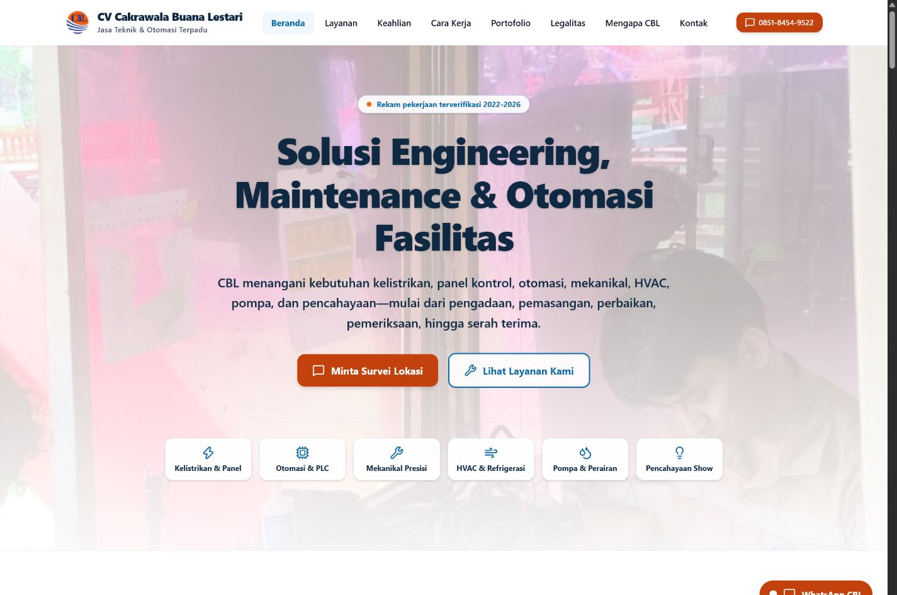
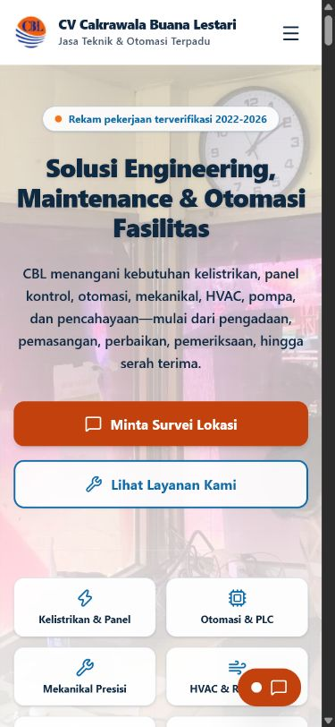
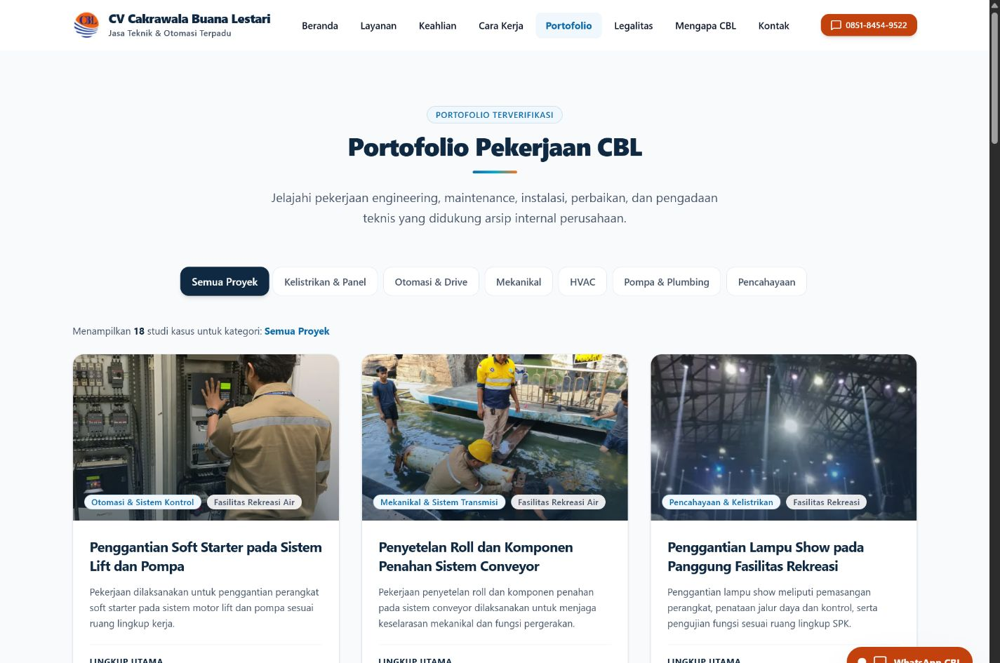
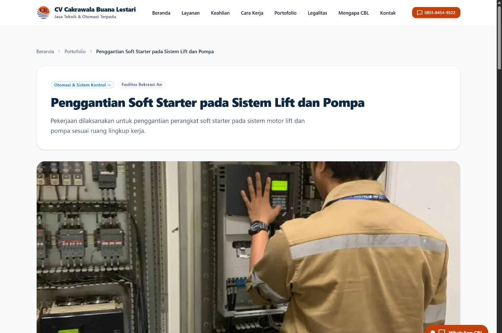
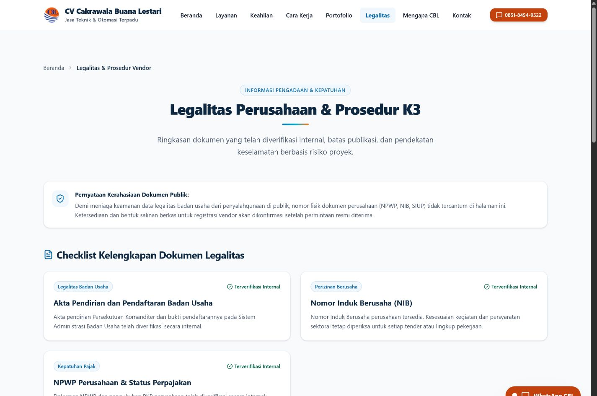
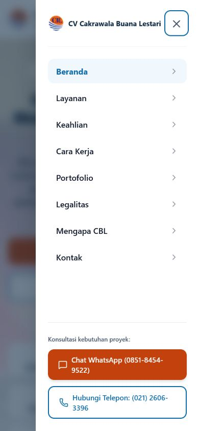

# Draft PR — Harden CBL website for Vercel preview readiness

## Summary

- align public company/project copy with the verified workbook and Company Profile while withholding sensitive transaction/legal data;
- keep native Next.js/Vercel architecture and upgrade Next.js to the patched 16.3.0 release;
- add canonical metadata, sitemap/robots consistency, Organization JSON-LD, generated OG image, and security headers;
- replace the generic 10.4 MB hero video with a relevant project image;
- improve mobile focus management, reduced-motion behavior, heading order, contrast, image delivery, and contact UX;
- document content provenance, deployment settings, rollback, risks, and owner confirmations.

## Verification

- [x] `npm ci`
- [x] `npm run check`
- [x] `npm audit --omit=dev` — 0 vulnerability
- [x] 31 sitemap/metadata endpoints — HTTP 200
- [x] representative browser QA — no broken image, horizontal overflow, or console warning/error
- [x] Lighthouse mobile/desktop across homepage/contact, projects, largest project detail, service detail, and legal page
- [x] accessibility/best-practices/SEO — 100 for every final Lighthouse run
- [x] no deploy, DNS change, push, or merge performed

## Screenshots

### Homepage — desktop

### Homepage — mobile

### Project index

### Project detail

### Legalitas

### Mobile navigation

## Reviewer focus

1. Confirm final domain and `NEXT_PUBLIC_SITE_URL`.
2. Confirm public service hours and whether any emergency support wording is permitted.
3. Decide whether to retain the current email or provide a domain email.
4. Approve a sanitized public Company Profile before enabling downloads.
5. Confirm permission for manufacturer logos and provide primary ZIP evidence for final content/photo re-check.

## Known non-blocking follow-ups

- Mobile LCP for project index/largest project detail is 3.1 s in Lighthouse lab throttling; performance score is 94.
- Development-only ESLint transitive dependencies are affected by brace-expansion advisories with no upstream fix; production audit is clean.
- CSP retains inline script/style allowances for the current Next.js implementation.

## Deployment decision

**CONDITIONAL GO for protected Preview/UAT.** Do not promote to production until owner confirmations are complete.
